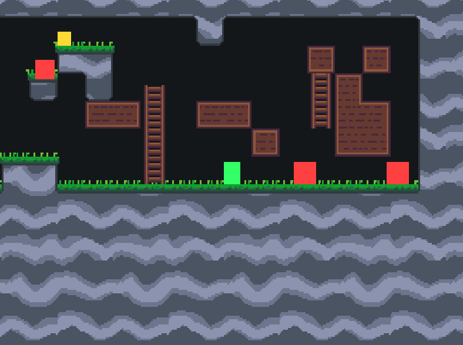

# Platosku 2

This is my platformer game (prototype) written in rust.



## TODO / Ideas

 * Player
   * [x] Safe platform edge jumping helping
   * [ ] Long press / short press jumping
   * [ ] Hitpoints and taking damage (and dying)
 * Boxes/Crates that are breakable
   * [ ] And drop loot/coins
 * [ ] Throwing things
 * [ ] Push blocks
 * Enemies
   * New enemies
     * [x] Bat
     * [x] Slime
     * [ ] Worm
 * Map
   * [x] Map editor
   * [x] Door between rooms
   * Platforms (pressing down+jump drops you down)
 * Optimizations
   * [ ] All sprites use just one draw call
   * [ ] Less looping over things multiple times

## Linters

Run linters locally with this command

```
cargo fix --bin platosku2 && cargo check && cargo fmt --all -- --check && cargo clippy --fix && cargo test
```

## Regenerate texture atlas:

Run this command to regenrate texture atlas

```
aseprite assets/sprites/*.aseprite --sheet-pack --sheet assets/atlas.png --data assets/atlas.json --batch --format json-array
```

